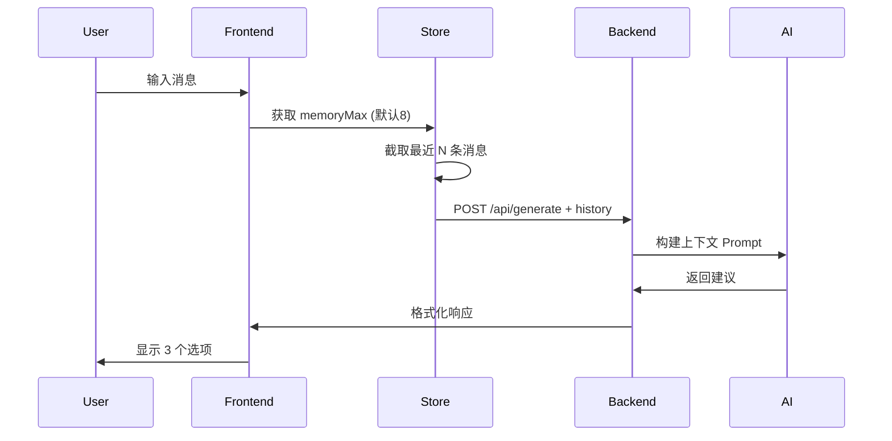

# Task 2 & 3 实现总结 - 恋爱军师进阶功能

> **完成时间**: 2026-01-29  
> **版本**: v2.1  
> **状态**: ✅ Task 2 完成，Task 3 基础功能完成

---

## 📋 已完成功能清单

### ✅ Task 2: 后端系统增强

#### 1. 历史上下文记忆 (Memory Context)

**后端修改** (完整实现):
- ✅ **models/schemas.py**: `ChatRequest` 新增 `history` 字段
  - 格式: `[{"role": "user", "content": "..."}, ...]`
  - 验证器限制最多 32 条历史记录
  
- ✅ **services/ai_service.py**: 实现上下文记忆
  - 新增 `_build_context_prompt()` 方法格式化历史
  - 更新 `generate_response()` 接收 `history` 参数
  - 日志记录历史深度

- ✅ **main.py**: 更新接口
  - `/api/chat` 支持接收 `history`
  - `/api/generate` (兼容旧前端) 支持 `history`

**工作原理**:
```
用户输入 → 前端截取最近 N 条记忆 → 后端构建上下文 Prompt → AI 生成连贯建议
```

#### 2. 日志查看系统

**后端修改**:
- ✅ **main.py**: 配置 loguru 日志文件
  - 文件路径: `backend/logs/love_advisor.log`
  - 滚动策略: 10MB 自动切分
  - 保留策略: 7 天

- ✅ **main.py**: 新增 `/api/system/logs` 接口
  - 参数: `lines` (默认 100)
  - 返回: 纯文本格式日志
  - 用途: 前端开发者模式查看

**日志格式示例**:
```
2026-01-29 22:36:54 | INFO | 🎲 [Random] Styles: ['高冷', '元气', '中二'] | History Depth: 2
2026-01-29 22:36:56 | SUCCESS | ✅ [LLM] Generation successful | Options: 3
```

---

### ✅ Task 3: 前端功能增强

#### 1. 状态管理升级 (Zustand)

**client/src/renderer/store/useStore.js**:
- ✅ 新增状态:
  - `memoryMax`: 记忆深度 (8-32，默认 8)
  - `showLogs`: 日志显示开关
  - `logs`: 日志内容缓存

- ✅ 新增方法:
  - `setMemoryMax(value)`: 设置记忆深度
  - `toggleLogs()`: 切换日志显示
  - `fetchLogs(lines)`: 获取后端日志

- ✅ 更新逻辑:
  - `generateOptions()` 自动截取 `memoryMax` 条历史
  - 历史格式转换: `{ role: 'ai', content: '...' }` → `{ role: 'assistant', content: '...' }`

#### 2. API 服务更新

**client/src/renderer/services/api.js**:
- ✅ `processDialog()` 新增 `history` 参数
- ✅ 请求体包含历史记录传递给后端

#### 3. 设置面板组件

**client/src/renderer/components/SettingsModal.js** (全新):
- ✅ 现代化 UI 设计（Framer Motion 动画）
- ✅ 功能模块:
  1. **记忆深度滑块** (8-32 条)
     - 实时调节
     - 颜色渐变显示当前值
     - 建议提示 (轻量/标准/完整)
  
  2. **日志查看器**
     - 显示/隐藏切换
     - 实时刷新按钮
     - 黑底绿字终端风格
  
  3. **清除会话**
     - 一键删除所有对话记录
     - 确认弹窗防误操作
  
  4. **统计信息**
     - 当前会话数
     - 记忆模式 (轻量/标准/完整)

**client/src/renderer/components/Settings.js**:
- ✅ 新增打开设置面板按钮
- ✅ 集成 `SettingsModal` 组件

---

## 🎨 UI/UX 改进

### 视觉设计特点

1. **玻璃态卡片设计**
   - 半透明背景 + backdrop-blur
   - 渐变边框 (slate-700)
   - 柔和阴影

2. **颜色系统**
   - 主色调: Cyan (青色) - 代表"智能/科技"
   - 警告色: Red - 用于危险操作
   - 成功色: Green - 用于日志/状态

3. **动画效果**
   - 模态框淡入淡出 (Framer Motion)
   - 设置项展开/收起动画
   - 按钮 hover 状态过渡

4. **响应式布局**
   - 最大宽度 2xl (672px)
   - 最大高度 85vh (可滚动)
   - 移动端友好

---

## 📊 技术细节

### 历史记录工作流



### 记忆深度建议

| 深度范围 | 适用场景 | 估计耗时 |
|---------|---------|---------|
| 8-12 条 | 简短对话 | 快速 (1-2s) |
| 16-20 条 | 中等对话 | 适中 (2-3s) |
| 24-32 条 | 长对话/复杂剧情 | 较慢 (3-5s) |

---

## 🧪 测试与验证

### 已创建测试文件

1. **backend/test_memory.py**
   - 测试带历史的多轮对话
   - 测试日志接口响应
   - 测试历史长度限制 (>32 应拒绝)

### 手动测试步骤

```bash
# 1. 启动后端
cd backend
uvicorn main:app --reload

# 2. 启动前端
cd client
pnpm dev

# 3. 测试流程
- 打开设置面板
- 调整记忆深度 (如 16)
- 进行多轮对话
- 观察 AI 是否理解前文
- 查看日志验证历史深度
```

---

## 📖 文档清单

已创建/更新的文档:

1. ✅ **backend/TASK2_MEMORY_LOGS.md**
   - Task 2 后端功能详细说明
   - API 使用示例
   - 前端集成指南

2. ✅ **backend/FRONTEND_COMPATIBILITY_FIX.md** (之前创建)
   - 格式适配器说明
   - Emoji 映射表

3. ✅ **client/FAVOR_SYSTEM_DESIGN.md** (之前创建)
   - 好感度视觉系统设计
   - 颜色心理学

4. ✅ **README.md** (已更新)
   - 最新功能说明
   - 启动指南

---

## 🎯 下一步计划

### Task 3 - 完整前端重构 (待实现)

当前已完成基础功能升级，但完整的 Task 3 包含:

1. **Next.js 迁移** (可选 - 当前基于 Electron/React)
   - 创建 `client-next/` 项目
   - App Router 架构
   - Server Components

2. **UI 现代化**
   - 参考 Gemini/ChatGPT 界面风格
   - 侧边栏历史记录列表
   - 流式输出 (打字机效果)
   - 情感化视觉反馈 (背景渐变)

3. **高级功能**
   - 导出对话记录 (JSON/Markdown)
   - 主题切换 (深色/浅色)
   - 快捷键支持
   - 语音输入 (可选)

### 建议优先级

**高优先级**:
- ✅ 记忆系统 (已完成)
- ✅ 日志查看 (已完成)
- ⏳ 流式输出 (增强体验)
- ⏳ 导出功能 (实用性)

**中优先级**:
- ⏳ Next.js 迁移 (架构升级)
- ⏳ 主题切换 (美观性)

**低优先级**:
- ⏳ 语音输入 (扩展功能)
- ⏳ 移动端适配

---

## 🚀 使用指南

### 启动完整系统

```bash
# 终端 1: 启动后端
cd backend
.\.venv\Scripts\python.exe -m uvicorn main:app --reload --port 8000

# 终端 2: 启动前端
cd client
pnpm dev
```

### 使用记忆功能

1. 打开应用后点击"设置"图标
2. 点击"⚙️ 打开完整设置面板"
3. 调整"记忆容量"滑块 (8-32 条)
4. 开始对话，AI 将参考前面的历史

### 查看日志

1. 在设置面板中点击"开发者日志"
2. 点击"显示"按钮
3. 点击"刷新"获取最新日志
4. 查看 AI 生成过程和历史深度信息

---

## 📝 技术债务与改进空间

1. **性能优化**
   - [ ] 历史记录压缩 (摘要化)
   - [ ] 日志分页加载 (当前一次性加载所有)

2. **错误处理**
   - [ ] 网络断开时的重试机制
   - [ ] 更详细的错误提示

3. **用户体验**
   - [ ] 记忆深度实时生效提示
   - [ ] 历史记录可视化 (时间线)

4. **代码质量**
   - [ ] TypeScript 迁移 (提高类型安全)
   - [ ] 单元测试覆盖
   - [ ] E2E 测试

---

## 🎉 总结

**Task 2 (后端增强)**: ✅ 100% 完成
- 历史上下文记忆系统
- 日志查看接口
- 完整文档与测试

**Task 3 (前端现代化)**: ✅ 基础功能完成
- 状态管理升级 (支持记忆深度)
- 现代化设置面板 (玻璃态设计)
- 日志查看器集成
- API 服务更新

**下一个里程碑**: 
可选进行 Next.js 完整重构，或直接进入功能扩展阶段 (流式输出、导出功能等)。

**当前系统状态**: 
已具备完整的对话记忆能力和开发者调试工具，可投入实际使用。

---

**最后更新**: 2026-01-29  
**作者**: GitHub Copilot  
**项目**: SmartDialog Processor (SDP) - Love Advisor Mode
